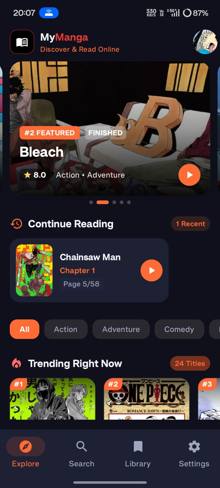
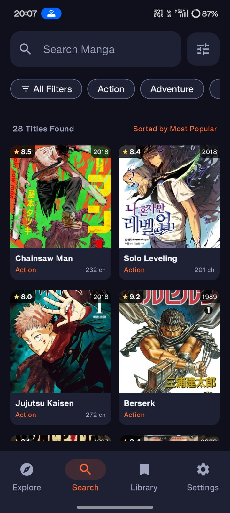
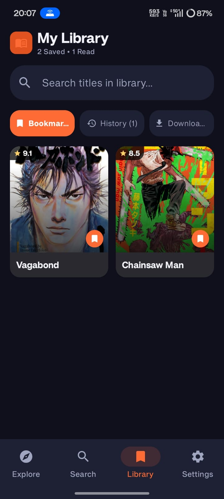
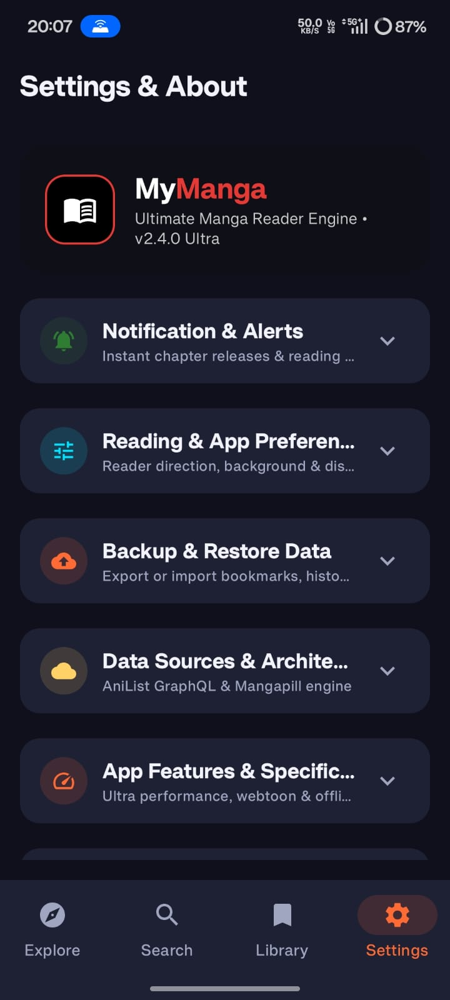
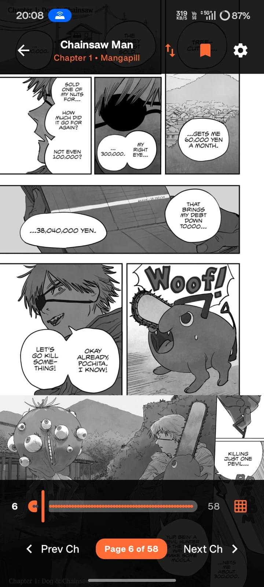
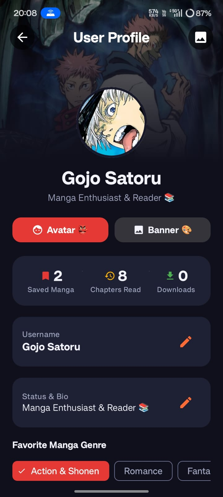
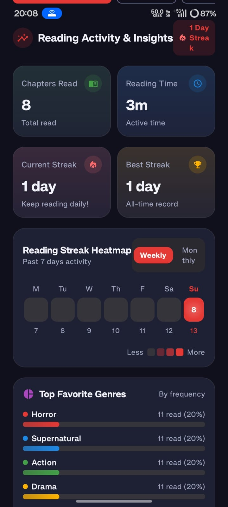

<p align="center">
  
</p>

<h1 align="center">MyManga</h1>

<p align="center">
  <b>A modern, high-performance Manga & Webtoon Reader app for Android built with Jetpack Compose & Material 3.</b>
</p>

<p align="center">
  
  
  
  
</p>

---

## 📱 App Screenshots

<p align="center">
  
  
  
  
</p>
<p align="center">
  
  
  
  
</p>

---

## ✨ Key Features

- **🎨 Modern Material Design 3 UI**:
  - Full AMOLED / OLED dark theme optimized for reading comfort.
  - Smooth Compose animations, edge-to-edge layouts, and responsive components.
- **⚡ Advanced Manga & Webtoon Reader**:
  - **Multiple Reading Modes**: Continuous Webtoon scroll, Right-to-Left (traditional Japanese Manga), Left-to-Right (Western / Manhwa), and Single Page mode.
  - **Interactive Controls**: Tap-zones navigation, pinch-to-zoom, fullscreen immersion, custom page spacing, brightness slider, and instant chapter switching.
- **🔍 Multi-Source Aggregation & Search**:
  - Live search across thousands of titles with genre tags, status filters, and sorting.
  - Integrated with multiple top providers (**MangaDex**, **Mangapill**, **WeebCentral**, and **AniList**) with smart fallback resolution.
- **📥 Offline Chapter Downloads**:
  - Download individual chapters or entire series for offline reading.
  - Built-in background download manager with queue status indicators.
- **📚 Library & Bookmarking**:
  - Organize manga into custom categories: *Reading*, *Completed*, *Plan to Read*, and *Favorites*.
  - Automatic reading progress persistence and unread chapter badges.
- **📊 Reading Analytics & History**:
  - Daily reading streaks and activity tracking.
  - Total reading time calculation and genre distribution breakdown.
- **🔒 Privacy & Local-First**:
  - Offline Room Database storage with zero invasive permissions required.

---

## 🛠️ Tech Stack & Architecture

- **Language**: [Kotlin](https://kotlinlang.org/)
- **UI Framework**: [Jetpack Compose](https://developer.android.com/jetpack/compose) with Material Design 3
- **Architecture**: MVVM (Model-View-ViewModel) + Clean Architecture + Unidirectional Data Flow (UDF)
- **Local Persistence**: [Room Database (SQLite)](https://developer.android.com/training/data-storage/room) & DataStore
- **Networking**: [Ktor Client](https://ktor.io/) & [Retrofit](https://square.github.io/retrofit/) / Jsoup HTML Scraper
- **Image Loading**: [Coil 3 (Compose)](https://coil-kt.github.io/coil/) with memory & disk caching
- **Concurrency**: Kotlin Coroutines & `StateFlow`
- **Background Tasks**: Android `WorkManager` & `AlarmManager`

---

## 📂 Project Structure

```
├── app/
│   ├── src/main/java/com/example/
│   │   ├── data/
│   │   │   ├── local/          # Room DB, DAOs & Entities
│   │   │   ├── network/        # API Clients & Scrapers (MangaDex, Mangapill, etc.)
│   │   │   └── repository/     # Manga Repository & Data Sources
│   │   ├── ui/
│   │   │   ├── screens/
│   │   │   │   ├── explore/    # Home & Trending Screen
│   │   │   │   ├── search/     # Search & Multi-Source Screen
│   │   │   │   ├── detail/     # Manga Details & Chapter List
│   │   │   │   ├── reader/     # Interactive Manga & Webtoon Reader
│   │   │   │   ├── library/    # Bookmarks & Collections
│   │   │   │   └── settings/   # Settings & Reading Stats
│   │   │   └── theme/          # Material 3 Color Schemes & Typography
├── screenshots/                # Showcase Screenshots & App Logo
│   ├── logo.png
│   ├── 01_explore_screen.png
│   ├── 02_search_screen.png
│   ├── 03_detail_screen.png
│   └── 04_reader_screen.png
└── README.md
```

---

## 🚀 Getting Started

### Prerequisites
- **Android Studio Ladybug (2024.2.1)** or newer
- **JDK 17** or **JDK 21**
- **Android SDK**: Min SDK 26 (Android 8.0+), Target SDK 35

### Build & Run
1. Clone the repository:
   ```bash
   git clone https://github.com/your-username/MyManga.git
   cd MyManga
   ```
2. Open the project in **Android Studio**.
3. Let Gradle sync dependencies, then run on your Android device or emulator (`Shift + F10`).
4. To assemble a release APK:
   ```bash
   ./gradlew assembleRelease
   ```

---

## 📄 License & Disclaimer

This project is open-source and intended solely for educational, personal, and non-commercial use. All manga titles, cover art, and intellectual property belong to their respective copyright holders and authors.
